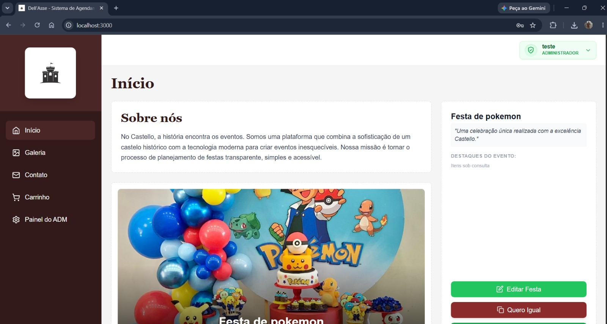
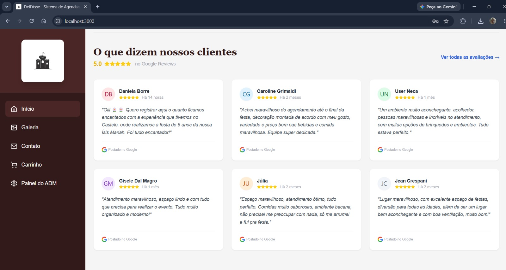
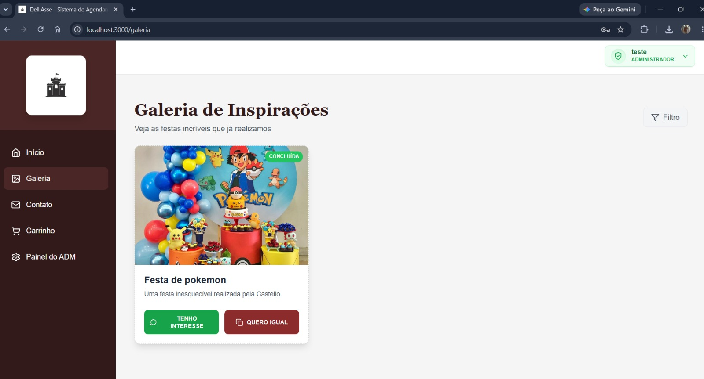
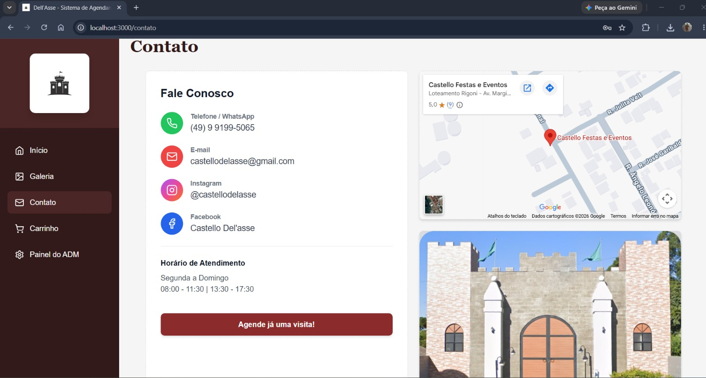
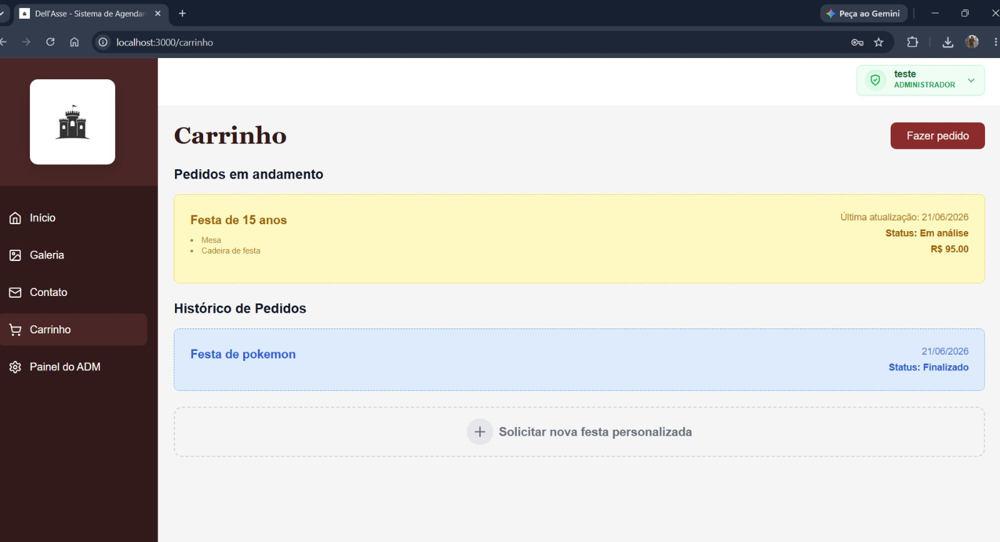
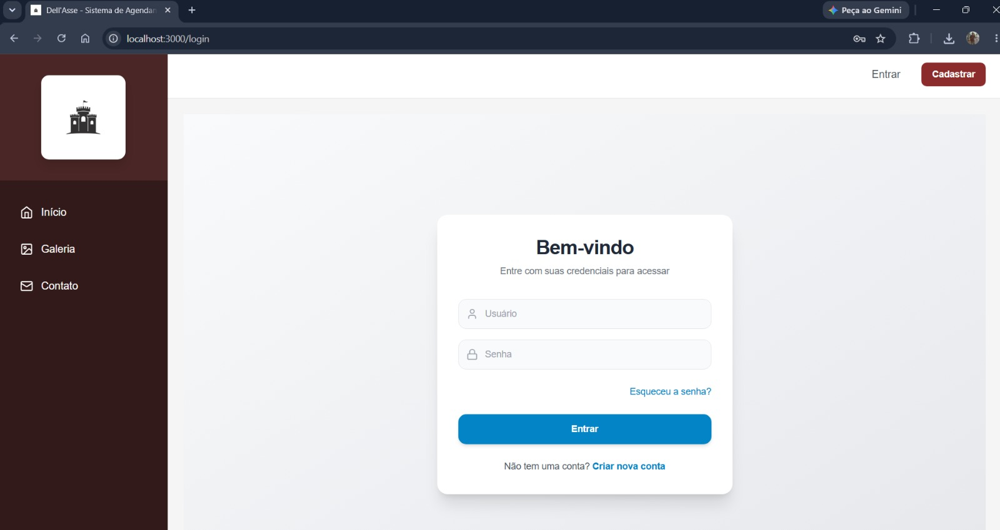
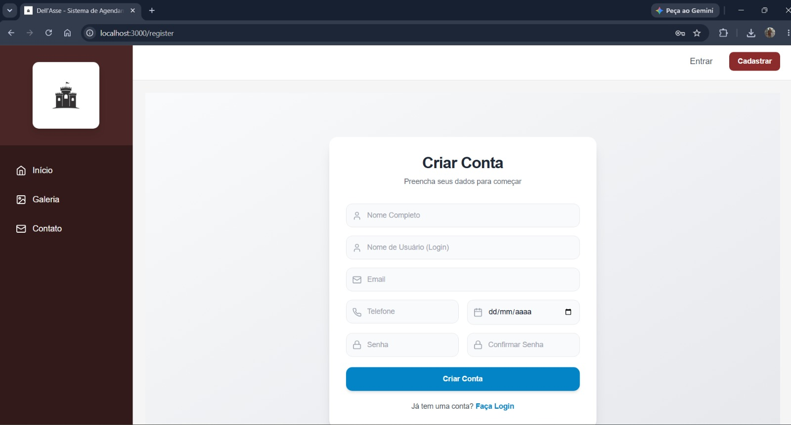

# Documento Técnico — Dell'Asse

**Sistema de Gestão e Agendamento de Festas**

---

## 1. Identificação do Trabalho

| Campo | Informação |
|-------|------------|
| **Curso** | Ciência da Computação / Sistemas de Informação |
| **Componente curricular** | Programação III |
| **Professor** | Wagner Titon |
| **Avaliação** | Avaliação Parcial – Desenvolvimento Prático |
| **Nome do projeto** | Dell'Asse |
| **Tema da solução** | Sistema web de gestão, orçamento e contratação de festas e eventos |
| **Versão do documento** | 1.0 |
| **Data** | Junho/2026 |

---

## 2. Integrantes do Grupo

| Integrante | GitHub |
|------------|--------|
| Eduardo Radin Valer | [[EduardoRadin](https://github.com/EduardoRadin)] |
| Lucas Miron Bradacz | [[LucasBradacz](https://github.com/LucasBradacz)] |
| Pedro Henrique Bender | [[PedroHBender](https://github.com/PedroHBender)] |
| João Pedro Zilli | [[zilliJoao](https://github.com/zilliJoao)] |
| Emilly Vani | [[Eminyx](https://github.com/Eminyx)] |
| Nathan Ritter Wendling | [[WendlingNathan](https://github.com/WendlingNathan)] |
| Eduardo Nofre | [[EduardoNofre007](https://github.com/EduardoNofre007)] |
| Marco Schons | [[marcoschons](https://github.com/marcoschons)] |

---

## 3. Repositório do Projeto

- **GitHub:** [[Dell'Asse](https://github.com/EduardoRadin/DellAsse)]

---

## 4. Objetivo da Solução

O **Dell'Asse** é uma aplicação web completa voltada ao gerenciamento de festas e eventos. A solução foi desenvolvida para centralizar o fluxo de cadastro, consulta, orçamento, personalização e contratação de festas em um único sistema, oferecendo uma experiência integrada para clientes e administradores.

### 4.1 Objetivo geral

Criar uma plataforma web funcional que permita divulgar festas, organizar produtos e serviços relacionados, montar eventos personalizados, calcular orçamentos e administrar os dados da operação por meio de uma arquitetura bem definida.

### 4.2 Objetivos específicos

- Centralizar o cadastro de usuários, empresas, produtos e festas;
- Permitir que clientes consultem festas e decorações disponíveis;
- Possibilitar a criação de festas personalizadas;
- Calcular orçamentos com aplicação de regras de desconto configuráveis;
- Garantir autenticação e autorização com controle por perfis (`ADMIN`, `FUNCIONARIO`, `BASIC`);
- Padronizar a comunicação entre front-end e back-end com DTOs e tratamento de erros unificado (`ApiError`);
- Organizar o sistema em camadas com separação clara de responsabilidades;
- Persistir dados em banco relacional e disponibilizar API REST para integração entre módulos.

---

## 5. Tecnologias Utilizadas

| Camada | Tecnologia | Versão / Observação |
|--------|------------|---------------------|
| Back-end | Java + Spring Boot | Java 21, Spring Boot 3.5 |
| Persistência | Spring Data JPA + PostgreSQL | `ddl-auto=update` em dev |
| Segurança | Spring Security + OAuth2 JWT | Token Bearer / Cookie |
| Mapeamento | MapStruct + Mappers manuais | DTO ↔ Entidade |
| Front-end | React + Vite | React 18, Tailwind CSS |
| HTTP Client | Axios | Interceptors para JWT e erros |
| Build | Maven (back-end) / npm (front-end) | — |
| Banco de Dados | PostgreSQL | Script em `database/CriacaoDB.sql` |
| Validação | Bean Validation | `@NotBlank`, `@DecimalMin`, etc. |

---

## 6. Arquitetura Adotada

O projeto adota **arquitetura em camadas** combinada com o padrão **MVC** no back-end e **componentes + serviços** no front-end.

### 6.1 Visão geral

```
┌─────────────────────────────────────────────────────────────┐
│                      FRONT-END (React)                      │
│  Pages / Components  →  Services (Axios)  →  API REST       │
└──────────────────────────────┬──────────────────────────────┘
                               │ HTTP + JSON
┌──────────────────────────────▼──────────────────────────────┐
│                    BACK-END (Spring Boot)                   │
│                                                             │
│  ┌─────────────┐   ┌─────────────┐   ┌──────────────────┐   │
│  │ Controllers │ → │  Services   │ → │  Repositories    │   │
│  │   (MVC)     │   │ (Negócio)   │   │  (Spring Data)   │   │
│  └──────┬──────┘   └──────┬──────┘   └────────┬─────────┘   │
│         │ DTOs            │ Entidades          │ SQL/JPA    │
│  ┌──────▼──────┐   ┌──────▼──────┐   ┌─────────▼─────────┐  │
│  │  Contracts  │   │   Models    │   │    PostgreSQL     │  │
│  │   (DTOs)    │   │  (Entidades)│   │                   │  │
│  └─────────────┘   └─────────────┘   └───────────────────┘  │
└─────────────────────────────────────────────────────────────┘
```

### 6.2 Separação de responsabilidades

| Papel MVC | Camada | Responsabilidade no Dell'Asse |
|-----------|--------|-------------------------------|
| **Model** | `models/` + `contracts/` | Entidades JPA representam o domínio; DTOs definem o contrato da API |
| **View** | Front-end React | Renderiza dados e envia requisições; sem regra de negócio crítica |
| **Controller** | `controllers/` | Recebe HTTP, valida entrada (`@Valid`), delega ao Service e retorna DTO/HTTP status |

**Fluxo típico de uma requisição:**

1. O **Controller** recebe JSON e converte para DTO (ex.: `PartyCreateRequest`);
2. O **Service** aplica regras de negócio, chama **Repositories** e **Mappers**;
3. O **Repository** persiste/consulta entidades no PostgreSQL;
4. A resposta retorna como DTO (ex.: `PartyResponse`) ou `ApiError` em caso de falha.

### 6.3 Estrutura de pastas do back-end

```
backend/src/main/java/com/dellasse/backend/
├── controllers/      # Endpoints REST (camada de apresentação)
├── service/          # Regras de negócio (camada de aplicação)
├── repositories/     # Acesso a dados (camada de persistência)
├── models/           # Entidades JPA
├── contracts/        # DTOs de entrada e saída
├── mappers/          # Conversão DTO ↔ Entidade
├── pricing/          # Cálculo de orçamento + Strategy de descontos
├── exceptions/       # ApiError, DomainException, GlobalException
├── infrastructure/   # Security, CORS, filtros JWT
├── config/           # Inicialização de dados (seed dev)
└── util/             # Utilitários (datas, status, conversões)
```

### 6.4 Estrutura de pastas do front-end

```
frontend/src/
├── components/       # Componentes reutilizáveis (Layout, Sidebar, etc.)
├── contexts/         # AuthContext, ConfigContext
├── pages/            # Páginas da aplicação
│   └── admin/        # Páginas administrativas
├── services/         # Serviços Axios por domínio
├── utils/            # Utilitários (apiError.js)
├── App.jsx
└── main.jsx
```

---

## 7. Design Patterns Aplicados

### 7.1 Repository Pattern

**Onde:** `repositories/` — interfaces que estendem `JpaRepository<Entity, Id>`.

**Por quê:** Abstrai o acesso ao banco. Os services dependem de interfaces, não de SQL direto. Facilita testes com mocks e isola a lógica de persistência.

**Exemplo:**
```java
public interface ProductRepository extends JpaRepository<Product, Long> {
    boolean existsByIdAndEnterprise_Id(Long id, UUID enterpriseId);
}
```

---

### 7.2 Service Layer Pattern

**Onde:** `service/` — classes anotadas com `@Service`.

**Por quê:** Centraliza regras de negócio fora dos controllers. Valida permissões, orquestra repositórios e lança `DomainException` quando necessário.

**Exemplo:** `PartyService.create()` valida roles do usuário, associa galeria, aplica valores padrão e recalcula o orçamento via `PartyBudgetCalculator` antes de persistir.

---

### 7.3 DTO (Data Transfer Object)

**Onde:** `contracts/` — records Java com validações Bean Validation.

**Por quê:** Desacopla a API das entidades JPA. Evita expor senhas, lazy-loading e estrutura interna do banco.

| DTO | Uso |
|-----|-----|
| `PartyCreateRequest` | Entrada para `POST /party/create` |
| `PartyResponse` | Saída padronizada de festas |
| `PartyBudgetResponse` | Detalhamento de orçamento com descontos |
| `ProductCreateRequest` | Entrada para criação de produtos |

---

### 7.4 Dependency Injection (Injeção de Dependência)

**Onde:** Spring Framework — `@Autowired` / construtor em services, controllers e strategies.

**Por quê:** O Spring instancia e injeta dependências automaticamente. Facilita testes e reduz acoplamento.

**Exemplo em `PartyBudgetCalculator`:**
```java
@Service
public class PartyBudgetCalculator {
    @Autowired
    private List<DiscountStrategy> discountStrategies; // Spring injeta todas as @Component
}
```

---

### 7.5 Strategy Pattern — Cálculo de Orçamento

**Onde:** `pricing/strategy/` + `PartyBudgetCalculator`.

**Problema:** Diferentes regras de desconto não devem ficar em um único `if/else` no service.

**Solução:** Interface `DiscountStrategy` com implementações intercambiáveis. O calculador percorre a cadeia e aplica apenas as estratégias cujo `supports()` retorna `true`.

**Interface:**
```java
public interface DiscountStrategy {
    boolean supports(PartyBudgetContext context);
    double calculateDiscount(PartyBudgetContext context);
    String getName();
}
```

**Implementações:**

| Classe | Regra |
|--------|-------|
| `VolumeDiscountStrategy` | 5% de desconto quando a festa tem 3 ou mais produtos |
| `CategoryDiscountStrategy` | 10% sobre itens da categoria `decoracao` |

**Benefício:** Novas regras são adicionadas criando uma nova classe `@Component` sem alterar código existente — princípio **Open/Closed** do SOLID.

---

## 8. Estrutura do Banco de Dados

### 8.1 Modelo relacional

```
enterprise ──┬── users ──┬── user_roles ── role
             │           │
             ├── product │
             │           │
             ├── party ──┴── party_products ── product
             │
             └── gallery ── image

cart ── (user, party, enterprise, total_price)
product_price_audit ── (log de alteração de preços)
```

### 8.2 Tabelas principais

| Tabela | Descrição | Chave |
|--------|-----------|-------|
| `enterprise` | Empresas parceiras | `id` (UUID) |
| `users` | Usuários do sistema | `uuid` (UUID) |
| `role` / `user_roles` | Perfis de acesso | `role_id` / N:N |
| `product` | Itens vendáveis (decoração, alimentação...) | `id` (serial) |
| `party` | Festas/eventos | `id` (serial) |
| `party_products` | Produtos vinculados à festa | N:N |
| `gallery` / `image` | Galerias de decoração | `id` |
| `cart` | Carrinho de compras | `id` |

### 8.3 Relacionamentos principais

- Uma empresa pode possuir vários usuários;
- Uma empresa pode possuir vários produtos e festas;
- Um usuário pode possuir vários perfis (N:N via `user_roles`);
- Uma festa pode possuir vários produtos (N:N via `party_products`);
- Uma galeria pode possuir várias imagens.

### 8.4 Scripts SQL

| Arquivo | Conteúdo |
|---------|----------|
| `database/CriacaoDB.sql` | DDL completo: tabelas, índices, views, procedures e triggers |
| `database/SeedDados.sql` | Dados de demonstração: admin, 3 produtos, 2 festas |

A view `vw_relatorio_orcamento` compara `party.generate_budget` com a soma dos preços dos produtos vinculados — útil para auditoria de orçamentos.

---

## 9. Diagrama Simplificado

Os diagramas do projeto estão disponíveis na pasta `Diagramas/`, organizados por tipo:

- **Diagramas/Classes/** — Diagrama de Classes (`DiagramaDeClasses.png`)
- **Diagramas/CasosDeUso/** — Casos de Uso (Login, Cadastro, Contratar Festa, Cancelar)
- **Diagramas/Sequencia/** — Sequência dos fluxos principais
- **Diagramas/Atividades/** — Atividades de cada processo
- **Diagramas/Estados/** — Máquina de estados (Festa, Login, Conta)

---

## 10. Interface Web

A solução possui interface web funcional, organizada por páginas e componentes reutilizáveis:

| Página | Descrição |
|--------|-----------|
| `Home.jsx` | Página inicial com apresentação da plataforma |
| `Gallery.jsx` | Galeria pública de decorações |
| `Parties.jsx` | Listagem de festas disponíveis |
| `CreateCustomParty.jsx` | Criação de festa personalizada com orçamento |
| `Cart.jsx` | Carrinho de produtos |
| `Login.jsx` / `Register.jsx` | Autenticação e cadastro de usuários |
| `Contact.jsx` | Página de contato |
| `AdminPanel.jsx` | Painel administrativo central |
| `admin/AddParty.jsx` | Cadastro de festas pelo administrador |
| `admin/ManageProducts.jsx` | Gerenciamento de produtos |
| `admin/ViewRequests.jsx` | Visualização de solicitações |
| `admin/ViewDatabase.jsx` | Visualização de dados administrativos |
| `admin/DeleteReview.jsx` | Exclusão de avaliações |

---

## 11. Prints da Aplicação

### 11.1 Tela inicial



### 11.2 Tela inicial — versão atualizada


### 11.3 Avaliações dos clientes



### 11.4 Galeria de Inspirações



### 11.5 Contato



### 11.6 Solicitar Festa Personalizada


### 11.7 Carrinho



### 11.8 Login



### 11.9 Cadastro



### 11.10 Painel do Administrador


### 11.11 ADM — Ver Solicitações


### 11.12 ADM — Visualizar Base de Dados


### 11.13 ADM — Cadastrar Produto


### 11.14 ADM — Apagar Avaliação


---

## 12. Explicação da API

### 12.1 Convenções gerais

- Base URL: `http://localhost:8080`
- Autenticação: `Authorization: Bearer <token>` (exceto rotas públicas)
- Formato de entrada e saída: JSON
- Erros: corpo padronizado `ApiError`

### 12.2 Rotas principais

| Método | Rota | Auth | Descrição |
|--------|------|------|-----------|
| POST | `/user/login` | Não | Autentica e retorna JWT |
| POST | `/user/create` | Não | Cadastra usuário |
| GET | `/user/all` | Sim | Lista usuários |
| POST | `/enterprise/create` | ADMIN | Cria empresa |
| GET | `/enterprise/{id}` | Sim | Busca empresa |
| POST | `/product/create` | Sim | Cria produto na empresa do usuário |
| GET | `/product/all` | Não* | Lista produtos |
| PATCH | `/product/update/{id}` | Sim | Atualiza produto |
| DELETE | `/product/{id}` | Sim | Remove produto |
| POST | `/party/create` | Sim | Cria festa com orçamento recalculado |
| POST | `/party/budget-preview` | Sim | Pré-visualiza orçamento sem persistir |
| GET | `/party/all` | Sim | Lista festas |
| GET | `/party/{id}` | Sim | Busca festa por ID |
| PATCH | `/party/{id}/status` | Sim | Atualiza status da festa |
| DELETE | `/party/{id}` | Sim | Remove festa |
| GET | `/party/gallery` | Não | Galeria pública de festas |
| POST | `/gallery/create` | Sim | Cria galeria |

### 12.3 Formato de erro (`ApiError`)

```json
{
  "timestamp": "2026-06-16T14:30:00-03:00",
  "status": 404,
  "error": "Not Found",
  "code": "PARTY_NOT_FOUND",
  "message": "Party not found",
  "path": "/party/99",
  "fieldErrors": null
}
```

| Campo | Descrição |
|-------|-----------|
| `code` | Identificador estável do erro (ex.: `PARTY_NOT_FOUND`, `VALIDATION_ERROR`) |
| `message` | Mensagem legível para o usuário |
| `fieldErrors` | Mapa campo → mensagem para erros de validação (Bean Validation) |

Tratamento centralizado em `GlobalException` (`@RestControllerAdvice`).

### 12.4 Erros comuns

| Código | Situação |
|--------|----------|
| `401 USER_NOT_AUTHENTICATED` | Faltou token ou token inválido |
| `403 ENTERPRISE_EXPIRED` | Empresa do usuário está expirada |
| `403 USER_NOT_ADMIN` | Rota exige perfil `ADMIN` |
| `404 PRODUCT_NOT_FOUND` | Produto não existe ou não pertence à empresa |
| `409 USER_ALREADY_EXISTS` | Tentativa de criar usuário duplicado |

### 12.5 Exemplo — pré-visualização de orçamento

**Request:** `POST /party/budget-preview`
```json
{ "products": [1, 2, 3] }
```

**Response:**
```json
{
  "subtotal": 1219.90,
  "discountAmount": 114.89,
  "total": 1105.01,
  "discounts": [
    { "name": "Desconto por volume (5%)", "amount": 60.99 },
    { "name": "Desconto em decoração (10%)", "amount": 53.99 }
  ]
}
```

### 12.6 Segurança

- **JWT** gerado no login com `scope` das roles do usuário;
- Filtros: `JwtCookieAuthenticationFilter` e `UserEnterpriseCheckFilter` (bloqueia empresa expirada);
- Senhas armazenadas com **BCrypt**;
- Autorização por perfil com `@PreAuthorize` em rotas administrativas;
- **CORS** configurado para `localhost` em ambiente de desenvolvimento.

---

## 13. Dificuldades Encontradas

Durante o desenvolvimento, os principais desafios foram:

**Configuração do ambiente:** A instalação e integração de múltiplas ferramentas (Java 21, Maven, PostgreSQL, Node.js, npm) gerou dificuldades iniciais, especialmente para membros com menos experiência em ambiente de desenvolvimento.

**Integração entre front-end e back-end:** A configuração do CORS para permitir comunicação entre React (porta 5173) e Spring Boot (porta 8080) exigiu atenção especial. Erros de preflight e headers incorretos foram depurados até a configuração correta em `CorsGlobalConfig`.

**Implementação do JWT:** A implementação dos filtros de segurança (`JwtCookieAuthenticationFilter` e `UserEnterpriseCheckFilter`) em cadeia com o Spring Security demandou entendimento profundo do ciclo de vida dos filtros HTTP e da Security Filter Chain.

**Cálculo de orçamento com Strategy Pattern:** Garantir que o orçamento calculado no `budget-preview` fosse idêntico ao calculado na criação da festa exigiu centralizar toda a lógica no `PartyBudgetCalculator` como fonte única de verdade.

**Modelagem do banco de dados:** O relacionamento N:N entre `party` e `product`, com o campo `generate_budget` sendo recalculado, exigiu criação de triggers e views no banco para auditoria.

**Padronização de erros:** Padronizar respostas de erro em toda a API usando o enum `DomainError` e o `@RestControllerAdvice` levou tempo para cobrir todos os cenários, especialmente erros de validação com `fieldErrors` por campo.

---

## 14. Diferenciais Implementados

- Autenticação com JWT e chaves RSA (`app.key` / `app.pub`);
- Controle de acesso por perfis (`ADMIN`, `FUNCIONARIO`, `BASIC`);
- Cálculo de orçamento com **Strategy Pattern** (extensível sem alteração de código);
- Pré-visualização de orçamento antes da criação da festa;
- Painel administrativo completo com gerenciamento de produtos, festas e avaliações;
- Galeria pública de festas sem necessidade de autenticação;
- Integração completa entre front-end React e API REST Spring Boot;
- Tratamento centralizado de erros com `ApiError` padronizado;
- Scripts de banco com views, procedures e triggers para auditoria;
- Documentação técnica complementar no diretório `docs/`;
- Diagramas UML completos no diretório `Diagramas/`.

---

## 15. Conclusão

O projeto **Dell'Asse** atende à proposta de desenvolvimento prático da disciplina ao entregar uma solução web completa, com front-end, back-end, banco de dados, organização arquitetural e aplicação de padrões de projeto. A estrutura do sistema demonstra separação de responsabilidades, persistência de dados, API de comunicação e interface navegável. A adoção do Strategy Pattern para cálculo de orçamento, a implementação de autenticação JWT com filtros encadeados e a padronização de erros consolidam os principais conceitos trabalhados em Programação III.

---

## 16. Referências Internas do Projeto

- [`README.md`](../README.md)
- [`docs/GuiaRapido.md`](./GuiaRapido.md)
- [`docs/ReqFuncionais.md`](./ReqFuncionais.md)
- [`docs/ReqNaoFuncionais.md`](./ReqNaoFuncionais.md)
- [`docs/GuiaFrontApiError.md`](./GuiaFrontApiError.md)
- [`database/CriacaoDB.sql`](../database/CriacaoDB.sql)
- [`database/SeedDados.sql`](../database/SeedDados.sql)
- [`Diagramas/`](../Diagramas/)
